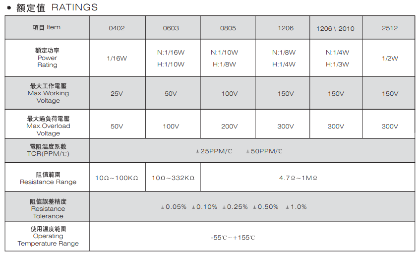
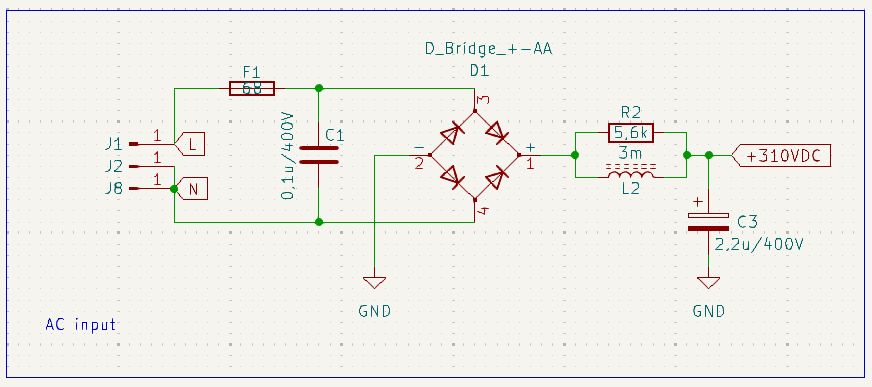
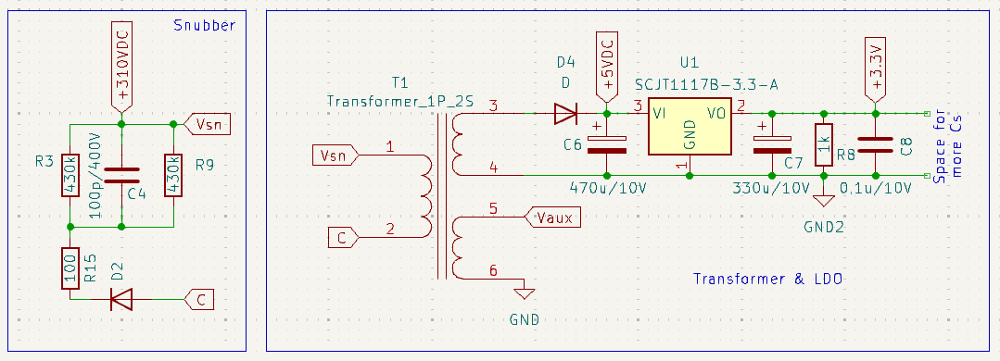
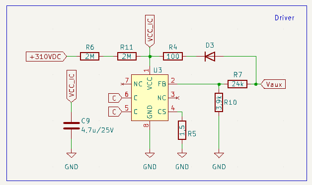
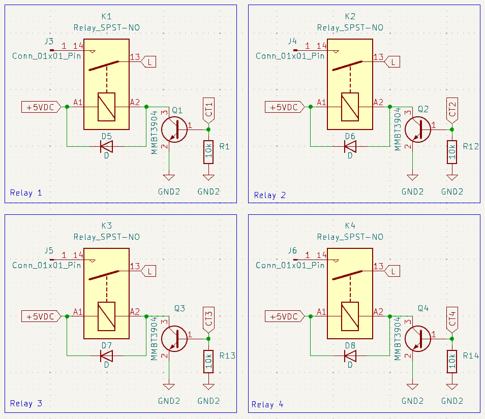

# Stage chez Rang Dong

## Introduction

Dans le cadre de mon stage au Vietnam au Posts and Telecommunications Institute of Technologies, j'ai eu l'occasion de réaliser un projet avec une de leurs entreprise partenaire : Rand Dong. Cette entreprise est spécialisé dans la conception et la vente de matériel pour la domotique (smart home, smart cities...) tels que des lampes connectés, des hubs de capteurs (température, pression...) ou encore des caméras connectés. J'ai eu l'occasion de rejoindre 4 équipes :
- software : design d'application mobiles
- firmware : programmation de systèmes embarqués
- cloud : stockage dans des databases
- hardware : design de circuit imprimé
Mon choix s'est tourné vers le hardware, domaine dans lequel j'ai pu approfondir mes connaissances, et ce principalement d'un point de vue technique, grâce à l'équipe de Rang Dong qui m'a épaulé durant l'entièreté de mon stage.

## Projet

Le projet qui m'a été confié fût de réalisé un "Touch switch". Il s'agit d'interrupteurs tactiles permettant de contrôler, dans le cas de mon projet, 4 lampes. Voici ci-dessous une photo d'un produit commercialisé par Rand Dong sur lequel je vais me baser.

  <table>
    <tr>
      <td align="center">
        
         
        <em>Touch Switch de chez Rang Dong</em>
      </td>
    </tr>
  </table>

A l'aide d'un contact avec le doigt sur l'un des ronds bleus, on allume une lampe à proximité. Ce principe à l'air simple car il est couramment utilisé et il nous accompagne au quotidien. Cependant, nous allons voir comment un tel projet est réalisé du début à la fin. Chez Rang Dong, ce genre d'objets est réalisé en 3 parties :
- une carte servant à l'alimentation (conversion AC/DC, relais...)
- une carte destiné au contrôle (microprocesseur...)
- le design de l'objet en lui-même, dans lequel sont camouflés les précédentes cartes
Dans un premier temps, j'ai conçu la carte servant à l'alimentation.

## Alimentation

### Choix des technologies

Le choix de l'alimentation est très importante pour tout projet, mais il l'est d'autant plus pour un projet comme celui-ci. En effet, ce dernier est destiné à n'importe quel client et de plus, ce client devra être en contact direct avec l'objet s'il souhaite l'utiliser. C'est pourquoi la sécurité était l'argument numéro un lors de mon choix. 2 propositions se sont vite dégagés au sein de l'équipe :
- alimentation buck
- alimentation flyback
D'un côté, l'alimentation buck permet la conversion à l'aide d'une inductance tandis que le flyback utilise un transformateur. De plus, le flyback permet une isolation galvanique entre la partie AC et la partie DC de la carte. Cependant, l'implémentation du flyback est plus compliqué que celle de l'alimentation buck. Comme dit précédemment, la sécurité de notre système est primordiale. Nous avons donc choisi l'alimentation flyback.

Nous avions besoin de récupérer 2 valeurs de tensions différents :
- une de 5V pour alimenter les relais
- une de 3.3V pour alimenter la carte de contrôle
Deux propositions sont égalements possible, dont voici les schémas équivalents :

  <table>
    <tr>
      <td align="center">
        
         
        <em>Proposition 1 pour l'alim AC</em>
      </td>
      <td align="center">
        
         
        <em>Proposition 2 pour l'alim AC</em>
      </td>
    </tr>
  </table>

Le premier choix consiste à utiliser 2 transformateurs ayant deux sorties et donc deux tensions de sortie différentes. Le deuxième, quant à lui, consiste à utiliser un régulateur de tension LDO pour récupérer 3.3V à partie des 5V de sortie du transformateur. Mon choix s’est naturellement posé sur le LDO, moins complexe à mettre en place et moins coûteux.
On mettra à l’entrée du transformateur un bloc snubber, permettant de limiter les pics de tension de l’alimentation AC et donc de protéger le transformateur.

### Choix des composants

Cette partie m’a énormément appris. Elle consiste non seulement à déterminer la valeurs des composants (résistances, capacités…) mais aussi à déterminer la taille des ses derniers en fonction de la puissance dissipée dans les résistances ou de la tension maximum des capacités. Pour les résistances, je me suis basé sur le tableau suivant venant de Fenghua.

  <table>
    <tr>
      <td align="center">
        
         
        <em>Tableau de taille des résistances</em>
      </td>
    </tr>
  </table>

Pour les capacités, j’ai suivi le tableau de chez Kemet, qui donne la taille des composants en fonction de leurs valeurs et tension maximale.

  <table>
    <tr>
      <td align="center">
        
         
        <em>Loi d'Ohm</em>
      </td>
    </tr>
  </table>

Pour mieux comprendre, voici un exemple rapide. Une résistance R est traversée par un courant I et a à ses bornes une tension V. La puissance qu’elle va dissiper est P = V\*I. En fonction de si l’on connaît seulement I ou V, on peut aussi déduire de la loi d'Ohm que P = V²/R ou P = I²\*R. Prenons dans notre exemple que nous avons déterminé R=1kΩ et Vmax=15V. On a alors P = 0,225W. En nous référant au tableau ci-dessus, on peut alors se permettre de choisir une résistance de taille 1206 ou plus, qui peut dissiper au maximum ¼W = 0,25W. Dans le cas où la puissance dépasse ½W, on peut mettre 2 résistances en parallèles, qui pourront dissiper 2 fois plus de puissance tout en gardant la même valeur. Prenons cette fois-ci Vmax=25V. On a alors P = 0,625W. En mettant deux résistances de 2kΩ en parallèle, on garde une résistance équivalente de 1kΩ et chacune d’entre elles doit seulement dissiper 0,3125W. Dans ce cas, on pourra choisir deux résistances de taille 2512.
Je n’ai pas détaillé le calcul pour chacun des composants, mais voici la méthode que j’ai suivie pour trouver leurs tailles.

### Implémentation sur Kicad

Maintenant que j’ai tous les éléments, je peux commencer à implémenter mon projet sur Kicad. J’ai séparé ce dernier en 4 grandes parties :

  <table>
    <tr>
      <td align="center">
        
         
        <em>Alimentation AC</em>
      </td>
      <td align="center">
        
         
        <em>Transformateur</em>
      </td>
    </tr>
    <tr>
      <td align="center">
        
         
        <em>Driver flyback</em>
      </td>
      <td align="center">
        
         
        <em>Relais</em>
      </td>
    </tr>
  </table>

J’ai également ajouté un connecteur 8 pins pour relier cette carte à celle de contrôle auquel seront connectés les sorties des 4 relais, la sortie du régulateur en 3.3V et la masse lui étant associée.
J’ai ensuite assigné chacun des éléments avec leurs empreintes, soit en choisissant les tailles définies précédemment, soit en demandant à mon équipe les datasheets qu’ils ont l’habitude d’utiliser pour les composants “spéciaux” tels que le driver, le transformateur, les relais…
