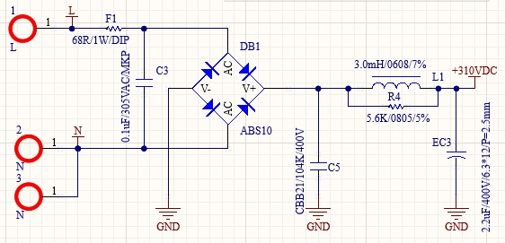

# Stage chez Rang Dong

## Introduction

Dans le cadre de mon stage au Vietnam au Posts and Telecommunications Institute of Technologies, j'ai eu l'occasion de réaliser un projet avec une de leurs entreprise partenaire : Rand Dong. Cette entreprise est spécialisé dans la conception et la vente de matériel pour la domotique (smart home, smart cities...) tels que des lampes connectés, des hubs de capteurs (température, pression...) ou encore des caméras connectés.

Exemple de photo :

  

