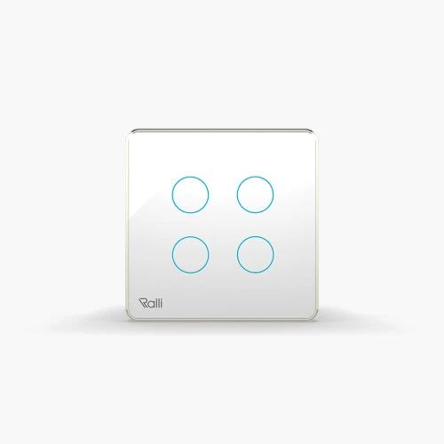
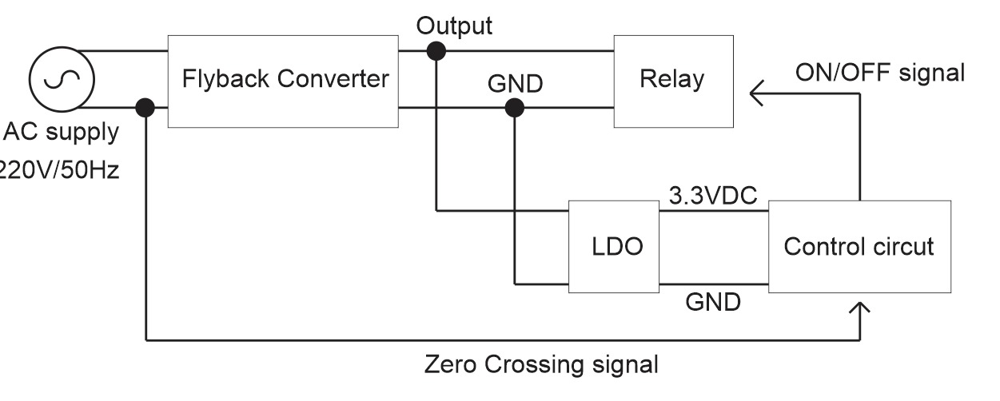
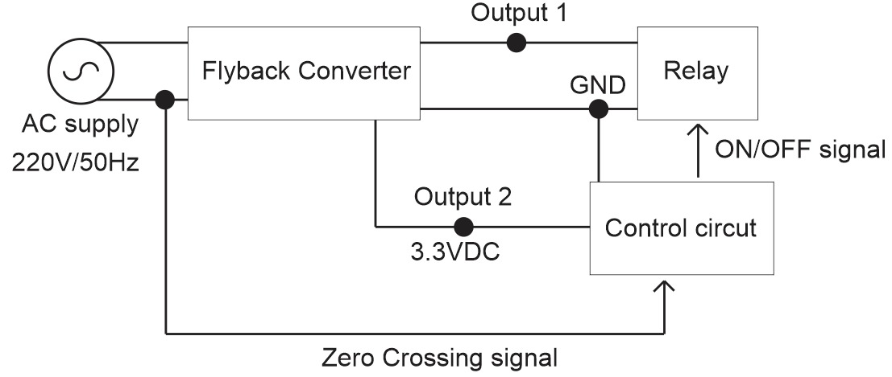

# Stage chez Rang Dong

## Introduction

Dans le cadre de mon stage au Vietnam au Posts and Telecommunications Institute of Technologies, j'ai eu l'occasion de réaliser un projet avec une de leurs entreprise partenaire : Rand Dong. Cette entreprise est spécialisé dans la conception et la vente de matériel pour la domotique (smart home, smart cities...) tels que des lampes connectés, des hubs de capteurs (température, pression...) ou encore des caméras connectés. J'ai eu l'occasion de rejoindre 4 équipes :
- software : design d'application mobiles
- firmware : programmation de systèmes embarqués
- cloud : stockage dans des databases
- hardware : design de circuit imprimé
Mon choix s'est tourné vers le hardware, domaine dans lequel j'ai pu approfondir mes connaissances, et ce principalement d'un point de vue technique, grâce à l'équipe de Rang Dong qui m'a épaulé durant l'entièreté de mon stage.

## Projet

Le projet qui m'a été confié fût de réalisé un "Touch switch". Il s'agit d'interrupteurs tactiles permettant de contrôler, dans le cas de mon projet, 4 lampes. Voici ci-dessous une photo d'un produit commercialisé par Rand Dong sur lequel je vais me baser.

  <table style="margin: 0 auto;">
    <tr>
      <td align="center">
        
         
        <em>Touch Switch de chez Rang Dong</em>
      </td>
    </tr>
  </table>

A l'aide d'un contact avec le doigt sur l'un des ronds bleus, on allume une lampe à proximité. Ce principe à l'air simple car il est couramment utilisé et il nous accompagne au quotidien. Cependant, nous allons voir comment un tel projet est réalisé du début à la fin. Chez Rang Dong, ce genre d'objets est réalisé en 3 parties :
- une carte servant à l'alimentation (conversion AC/DC, relais...)
- une carte destiné au contrôle (microprocesseur...)
- le design de l'objet en lui-même, dans lequel sont camouflés les précédentes cartes
Dans un premier temps, j'ai conçu la carte servant à l'alimentation.

### Alimentation

Voici un schema de l'alimentation choisie pour la carte :

  <table style="margin: 0 auto;">
    <tr>
      <td align="center">
        
         
        <em>Proposition 1 pour l'alim AC</em>
      </td>
      <td align="center">
        
         
        <em>Proposition 2 pour l'alim AC</em>
      </td>
    </tr>
  </table>

Le choix de l'alimentation est très importante pour tout projet, mais il l'est d'autant plus pour un projet comme celui-ci. En effet, ce dernier est destiné à n'importe quel client et de plus, ce client devra être en contact direct avec l'objet s'il souhaite l'utiliser. C'est pourquoi la sécurité était l'argument numéro un lors de mon choix. 2 propositions se sont vite dégagés au sein de l'équipe :
- alimentation buck
- alimentation flyback
